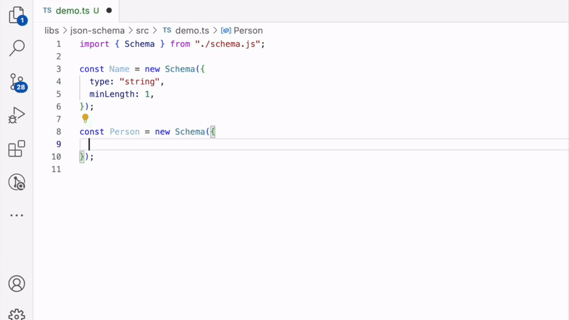

최근 JavaScript/TypeScript 생태계에서는 다양한 데이터 검증 라이브러리가 등장하며, 서로 다른 접근 방식으로 발전해 왔습니다. [Zod](#zod)는 선언적 API를 제공하고, [Ajv](#ajv)는 [JSON Schema](#json-schema) 초안을 충실히 따르며, [class-validator](#class-validator) 는 데코레이터 기반의 유효성 검사를 지원합니다. 이러한 흐름 속에서 저 또한 JSON Schema의 유연성과 확장성에 매력을 느껴 이를 깊이 탐구하게 되었습니다.

처음에는 Ajv를 사용하려 했지만, 개발 과정에서 몇 가지 한계를 경험하며 직접 라이브러리를 만들어야겠다는 결론에 이르렀습니다. 이번 글에서는 그 과정에서 마주한 기술적 도전과 해결 방법, 그리고 얻은 인사이트를 공유하고자 합니다.

## 기존 라이브러리의 한계와 도전 계기

Ajv는 JSON Schema 생태계에서 가장 널리 사용되는 라이브러리지만, TypeScript 환경에서 다음과 같은 타입 추론의 한계가 있었습니다.

```ts
import Ajv from 'ajv';

const ajv = new Ajv();

const validate = ajv.compile({
  type: 'object',
  // ❌ 여기서 무언가 입력을 시작해도 `object` 타입에 유효한 키워드를 추론하지 않습니다.
});

const data = {
  foo: 1,
  bar: 'hello',
}

// ❌ validate()의 반환값이 boolean이므로, TypeScript는 타입 안전성을 보장할 수 없습니다.
if (validate(data)) {
  data.foo // ❌ `foo` 속성에 접근할 수 없습니다.
}
```

물론, 이 문제는 [Ajv Utility Types](#ajv-typescript)를 통해 해결할 수 있지만, 이는 **스키마와 타입 정의를 이중으로 관리해야 하는** 새로운 문제를 야기합니다. 이상적으로는, 스키마 정의 자체가 타입 정보를 제공할 수 있어야 한다고 생각했습니다.

## 개발 접근 방식 결정

이러한 문제를 해결하기 위해 두 가지 접근 방식을 고려했습니다.

1. 기존 라이브러리를 확장하여 타입 추론 기능을 개선하는 방법
2. 처음부터 타입 추론에 최적화된 새로운 구현체를 개발하는 방법

신중한 검토 끝에 두 번째 방법을 선택했습니다. 완전히 새로운 구현체를 만듦으로써 타입 시스템을 처음부터 설계할 수 있고, 더 나은 개발자 경험을 제공할 수 있다고 판단했기 때문입니다.

## 주요 기술적 과제와 해결 과정

새로운 라이브러리를 개발하면서 특히 해결해야 할 두 가지 핵심 과제가 있었습니다.

1. **테스트 자동화** – JSON Schema의 다양한 테스트 케이스를 효율적으로 검증하는 방법
2. **Format 키워드 구현** – RFC 표준을 준수하면서도 유지보수하기 쉬운 방식으로 형식 검증을 지원하는 방법

이 과정에서 어떤 문제를 마주했으며, 어떻게 해결해 나갔는지 공유해 보겠습니다.

## 테스트 자동화

JSON Schema 팀에서는 [JSON-Schema-test-suite](#json-schema-test-suite) 저장소를 통해 다양한 JSON Schema 테스트 케이스를 제공하고 있었습니다.

이 테스트 케이스를 활용하면 구현체의 정확성을 검증하는 데 큰 도움이 되었지만, 이를 효율적으로 관리하고 실행하는 과정에서 몇 가지 도전 과제에 직면했습니다.

특히, **테스트를 자동화하고 일관된 방식으로 실행할 수 있도록 만드는 것**이 핵심 과제였습니다.

### 초기 접근 방식

처음에는 다음과 같은 방식으로 테스트 자동화를 시도했습니다.

1. 저장소를 동기화하여 최신 테스트 케이스를 가져온다.
2. 디렉토리 구조를 분석하고 버전별 테스트 파일을 수집한다.
3. TS Compiler API를 활용해 각 테스트 케이스에 대한 타입 정의를 생성한다.
4. 생성된 타입을 활용해 자동화된 테스트 함수를 작성하고 실행한다.

### 구현 과정

우선, **저장소 동기화를 자동화하기 위해 CLI 스크립트와 필요한 유틸리티를 직접 작성**했습니다.

이를 통해 최신 테스트 케이스를 빠르고 안정적으로 로컬 환경으로 가져올 수 있도록 했습니다.

```ts
#!/usr/bin/env node

// 저장소 동기화
await gitFetch({
  org: "json-schema-org",
  repo: "JSON-Schema-Test-Suite",
});

// 타입 정의 생성
await writeTsFile(createInterface("Vocabulary", vocabulary));
await writeTsFile(createInterface("Alias", alias));
await writeTsFile(createType("Version", Object.keys(vocabulary)));

```

다음으로, 테스트 실행을 쉽게 관리할 수 있도록 `TestCaseManager` 클래스를 설계했습니다.

```ts
export class TestCaseManager<T extends keyof Vocabulary = keyof Vocabulary> {
  constructor(public readonly version: T) {}

  load = memoize(
    async <K extends Vocabulary[T]>(
    keyword: K,
    options?: { skip?: string[] },
    ) => { ... },
  );
}

// 최신 버전 테스트를 위한 인스턴스
export const latestTestCase = new TestCaseManager("latest");

```

이제 실제 테스트 코드에서는 `TestCaseManager`를 활용해 JSON Schema 검증을 자동화할 수 있었습니다.

```ts
import { expect, test } from "vitest";
import { Schema } from "../../schema.js";
import {
  TestCaseManager,
  latestTestCase,
} from "../../utils/test-case-manager.js";

test.concurrent.for(await latestTestCase.load("additionalProperties"))(
  TestCaseManager.format,
  (testCase) => {
    const schema = new Schema(testCase.schema);
    expect(schema.validate(testCase.data)).toBe(testCase.expected);
  },
);
```

### 시행착오와 개선점

처음에는 이 방식이 효과적이라고 생각했지만, 몇 가지 중요한 문제를 발견하게 되었습니다.

1. **성능 문제** – 모든 테스트 파일을 동적으로 읽어들이는 방식은 실행 속도가 현저히 느려질 수밖에 없었습니다.
2. **유지보수 복잡성** – 자동화 도구를 만들었지만, 정작 그 도구를 유지보수하는 데 더 많은 시간이 들게 되는 역설적인 상황이 벌어졌습니다.

이 문제를 해결하기 위해 TS Compiler API를 활용한 **테스트 파일 자동 생성 CLI 도구**까지 만들었지만, 시간이 지나면서 자연스럽게 의문이 들기 시작했습니다.

> "이걸 왜 만들었지...?"

그런데, JSON Schema 팀이 이미 **[Bowtie](#bowtie)**라는 강력한 CLI 테스팅 도구를 제공하고 있다는 사실을 알게 되었습니다.

> "아... 이미 다 있었구나..."

결국 삽질의 긴 여정을 마무리하고, 다시 원점으로 돌아와 **더 단순하고 현실적인 해결책**을 고민하기 시작했습니다.

## Format 키워드 구현

JSON Schema의 [Format 키워드](#format-keyword)는 다양한 **RFC 표준**을 기반으로 한 검증 기능을 제공합니다. 예를 들어, `date-time`이나 `uri`와 같은 특정 문자열 형식을 검증할 수 있습니다.

저는 이 기능이 단순히 동일한 라이브러리에 포함되기에는 그 범위가 너무 넓다고 판단했습니다. 따라서, 이 기능을 **별도의 라이브러리**로 분리하고, 개발자에게 친숙한 네이티브 [JSON API](#json-api)와 [Date API](#date-api)와 유사한 인터페이스를 제공하고자 했습니다.

```ts
import { FullTime } from "@imhonglu/format";

// RFC 표준에 따른 시간 문자열 파싱
const time = FullTime.parse("15:59:60.123-08:00", {
  year: 1998,
  month: 12,
  day: 31,
});
// 결과:
// {
//   hour: 15,        // 시간
//   minute: 59,      // 분
//   second: 60,      // 초 (윤초 고려)
//   secfrac: ".123", // 소수점 이하
//   offset: {        // 시간대 오프셋
//     sign: "-",     // 부호
//     hour: 8,       // 시간
//     minute: 0      // 분
//   }
// }

// 표준 형식으로 문자열 변환
console.log(FullTime.stringify(time));
// '15:59:60.123-08:00'

// JSON 직렬화 지원
console.log(JSON.stringify(time));
// '"15:59:60.123-08:00"'

// 객체 내부에서도 자동 직렬화
console.log(
  JSON.stringify({
    name: "John",
    createdAt: time,  // FullTime 인스턴스가 자동으로 문자열로 변환됨
  })
)
// '{"name":"John","createdAt":"15:59:60.123-08:00"}'
```

### Serializable Decorator

우선, 반복적으로 사용되는 [Formatter](#formatter)를 쉽게 정의할 수 있도록 [Serializable Decorator](#serializable-decorator)를 먼저 구현했습니다.

```ts
import {
  type Fn,
  type SafeResult,
  createSafeExecutor,
} from "@imhonglu/toolkit";

export function Serializable<
  T extends Fn.Newable & {
    parse: Fn.Callable<{ return: InstanceType<T> }>;
    safeParse: Fn.Callable<{ return: SafeResult<InstanceType<T>> }>;
    stringify: Fn.Callable<{ args: [InstanceType<T>]; return: string }>;
  },
>(targetClass: T) { ... }
```

`Decorator`를 사용한 이유는 두 가지였습니다.

1. `Generic`을 활용해 `Abstract Implement Class`처럼 동작하게 만들 수 있다는 점 ([관련 이슈](#abstract-implement-class-related-issue))
2. 특정 메서드(`parse`, `stringify`, `safeParse` 등)를 자동으로 구현하거나, 구현을 강제할 수 있다는 점

예를 들어, 다음과 같이 `@Serializable`을 적용하면 구현을 강제할 수 있습니다.

```ts
@Serializable
// ^^^^^^^^^^
// `parse`, `stringify`, `safeParse`가 구현되지 않은 경우 컴파일 오류 발생
class MyClass { ... }

```

또한, 자동으로 `toString()`, `toJSON()`, `safeParse()` 메서드를 구현합니다.

```ts
@Serializable
class MyClass {
  ...
  // `toString()`, `toJSON()`, `safeParse()`를 자동으로 구현
}

```

이렇게 하면 필요한 메서드 구현을 자동화하면서, 동시에 인터페이스를 명확하게 강제할 수 있습니다.

### ABNF 문법과 정규식

RFC 문서에서 제공하는 [ABNF](#abnf-wiki) 문법을 정규식으로 변환하는 과정에서 코드의 **재사용성과 디버깅이 어려운 문제**를 겪었습니다. 특히, [RFC 3986](#rfc-3986)의 `uri` 구현에서 이런 한계가 두드러졌죠.

예를 들어, 다음과 같은 정규식은 특정 문자가 누락되거나 업데이트될 경우 **어디에서 문제가 발생했는지 파악하기가 매우 어려웠습니다.**

```ts
const userinfo = /[a-zA-Z0-9\-._~!$&'()*+,;=:]+/;
```

#### 🚀 해결책: 패턴을 조립하는 방식으로 개선

이 문제를 해결하기 위해 [Builder Pattern](#builder-pattern)을 적용한 [@imhonglu/pattern-builder](#imhonglupattern-builder) 라이브러리를 개발했습니다. 이를 활용하면 **ABNF 문법을 보다 직관적이고 유지보수하기 쉬운 코드로 변환**할 수 있습니다.

우선, 가장 기본이 되는 패턴들을 정의합니다.

```ts
import { characterSet, concat, hexDigit } from "@imhonglu/pattern-builder";

export const unreserved = characterSet(alpha, digit, /[\-._~]/);
export const pctEncoded = concat("%", hexDigit.clone().exact(2));
export const subDelims = characterSet(/[!$&'()*+,;=]/);
```

이렇게 정의된 패턴을 조합해 더 복잡한 규칙을 만들 수 있습니다.

```ts
export const pchar = oneOf(
  pctEncoded,
  characterSet(unreserved, subDelims, /[:@]/),
);
```

그리고 최종적으로 **URI 경로 패턴**을 완성합니다.

```ts
const slash = characterSet("/").optional();

const path = concat(
  concat(slash, pchar.clone().nonCapturingGroup().oneOrMore())
    .nonCapturingGroup()
    .zeroOrMore(),
  // 선택적 종료 슬래시
  slash,
)
  .anchor()
  .toRegExp();
```

#### ✅ 이렇게 개선하니 훨씬 좋아졌습니다!

패턴을 단계적으로 정의하는 방식 덕분에,

- ABNF 규칙의 **의도와 역할**을 더 명확하게 표현할 수 있습니다.
- 각각의 패턴을 독립적으로 수정하고 재사용할 수 있습니다.
- 특정 부분만 따로 테스트하고 디버깅할 수 있습니다.

이러한 개선 덕분에 **코드의 가독성과 유지보수성이 크게 향상**되었고, 결과적으로 [@imhonglu/format](#imhongluformat) 라이브러리의 견고한 기반이 되었습니다.

## JSON Schema 구현체 소개

지금까지 설명한 여러 도전 과제들을 해결하며, 결과적으로 다음과 같은 특징을 가진 라이브러리를 개발하게 되었습니다.

아래 데모는 제가 개발한 라이브러리의 특징을 보여주는 데모입니다.



### 🛠 라이브러리 특징

- JSON Schema 2020-12 Draft 사양을 준수합니다.
- 스키마를 정의할 때 알맞는 키워드를 정적으로 추론합니다.
- 결정된 스키마의 타입을 정적으로 추론합니다.
- 중첩된 `Schema Instance`에 대한 재귀적 타입 추론을 지원합니다.
- `required` 키워드에 따른 타입 추론이 가능합니다.
- `parse`, `stringify` 메서드를 제공하여 스키마를 쉽게 변환하고 활용할 수 있습니다.
- [JSON-Schema-test-suite](#json-schema-test-suite)를 기반으로 검증되었습니다.

의도치 않게 개발 과정에서 단순한 타입 문제 해결보다 JSON-Schema-test-suite 기반 자동 테스트 케이스 생성에 더 많은 시간을 투자하게 되었습니다. 또한, `format` 키워드 지원을 위해 RFC 사양을 분석하는 데도 많은 노력을 기울였습니다. 이러한 과정은 예상보다 많은 시간이 소요되었지만, 결과적으로 프로젝트의 완성도를 높이는 데 큰 도움이 되었습니다.

### 🚀 향후 계획

현재 기본적인 기능은 구현되었지만, 아직 개선의 여지가 많이 있습니다. 앞으로 다음과 같은 부분들을 중점적으로 발전시켜 나갈 계획입니다.

1. **사용자 정의 기능**
   - 스키마 유효성 검사 메시지 커스터마이징
   - 사용자 정의 에러 핸들링
   - 검증 규칙 확장 지원

2. **개발자 경험 개선**
   - 더 자세한 에러 메시지와 디버깅 정보 제공
   - 문서화 개선

3. **성능 최적화**
   - 스키마 컴파일 과정 최적화
   - 메모리 사용량 개선

### 🤝 참여하기

이 프로젝트는 아직 발전 중이며, 커뮤니티의 피드백과 기여를 환영합니다. 관심 있으신 분들은 [저장소](https://github.com/imhonglu/new-wheels/tree/main/libs/json-schema)를 방문해 주세요.

여러분의 의견과 제안이 이 라이브러리를 더욱 발전시키는 원동력이 될 것입니다. 감사합니다!

## 참고

#### [Zod](https://zod.dev/)
TypeScript에서 타입 안전성을 보장하며, 다양한 데이터 구조를 검증할 수 있는 강력한 라이브러리입니다. 특히, 스키마 기반의 데이터 검증을 쉽게 수행할 수 있습니다.

#### [class-validator](https://github.com/typestack/class-validator)
`NestJS`와 함께 사용되며, 데코레이터 기반으로 객체의 유효성을 검사할 수 있는 라이브러리입니다. 다양한 유효성 검사 데코레이터를 제공합니다.

#### [Ajv](https://github.com/ajv-validator/ajv)
JSON Schema를 사용하여 데이터의 유효성을 검증하는 고성능 라이브러리로, Node.js 환경에서 널리 사용됩니다. 최신 JSON Schema 표준을 지원합니다.

#### [JSON Type Definition](https://json-schema.org/draft/2020-12/json-schema-type-definitions)
JSON 데이터의 타입을 정의하고 검증하기 위한 표준 사양으로, JSON Schema와 유사하지만 더 간결한 문법을 제공합니다.

#### [JSON Schema](https://json-schema.org/)
JSON 데이터의 구조를 정의하고 검증하기 위한 초안 사양으로, 다양한 데이터 형식을 지원하며, 데이터의 유효성을 보장합니다.

#### [Ajv TypeScript](https://ajv.js.org/guide/typescript.html#utility-types-for-schemas)
Ajv에서 제공하는 TypeScript 유틸리티 타입을 사용하여 JSON Schema와 TypeScript 타입 간의 상호 운용성을 높일 수 있는 문서입니다.

#### [TS Compiler API](https://github.com/microsoft/TypeScript/wiki/Using-the-Compiler-API)
TypeScript 코드를 프로그램적으로 분석하고 변환할 수 있는 강력한 API로, TypeScript 컴파일러의 내부 기능을 활용할 수 있습니다.

#### [Format Keyword](https://json-schema.org/draft/2020-12/draft-bhutton-json-schema-validation-01#section-7)
JSON Schema에서 특정 형식의 문자열을 검증하기 위한 키워드로, 다양한 형식의 데이터 유효성을 검사할 수 있습니다.

#### [JSON-Schema-Test-Suite](https://github.com/json-schema-org/JSON-Schema-Test-Suite)
JSON Schema 구현체의 정확성을 검증하기 위한 공식 테스트 케이스 모음입니다.

#### [JSON-Schema-Test-Suite/tree/main/tests](https://github.com/json-schema-org/JSON-Schema-Test-Suite/tree/main/tests)
JSON Schema Test Suite의 테스트 스키마가 위치한 디렉토리로, 다양한 테스트 케이스가 포함되어 있습니다.

#### [gitFetch](https://github.com/imhonglu/new-wheels/blob/main/tools/build-tools/src/utils/git-fetch.ts)
Git 저장소를 동기화하기 위한 유틸리티 함수로, 원격 저장소의 최신 상태를 로컬로 가져올 수 있습니다.

#### [Bowtie](https://docs.bowtie.report/en/stable/)
JSON Schema 구현체의 테스트를 자동화하기 위한 CLI 도구로, 다양한 테스트 케이스를 쉽게 실행할 수 있습니다.

#### [JSON API](https://developer.mozilla.org/ko/docs/Web/JavaScript/Reference/Global_Objects/JSON)
JavaScript에서 JSON 데이터를 다루기 위한 표준 API로, JSON 문자열을 객체로 변환하거나 객체를 JSON 문자열로 변환할 수 있습니다.

#### [Date API](https://developer.mozilla.org/ko/docs/Web/JavaScript/Reference/Global_Objects/Date)
JavaScript에서 날짜와 시간을 다루기 위한 표준 API로, 날짜 객체를 생성하고 조작할 수 있습니다.

#### Formatter
RFC 표준에 기반한 문자열 형식 검증을 수행하는 내부 구현체를 지칭하는 용어입니다.

#### [Serializable Decorator](https://github.com/imhonglu/new-wheels/blob/main/libs/format/src/utils/serializable/serializable.ts)
[Formatter](#formatter) 를 구현하기 위한 `Class Decorator` 입니다.

#### [Abstract Implement Class Related Issue](https://github.com/microsoft/TypeScript/issues/22815)
TypeScript에서 추상 구현 클래스와 관련된 이슈로, 추상 클래스의 구현 세부 사항에 대한 논의가 포함되어 있습니다.

#### [ABNF WIKI](https://en.wikipedia.org/wiki/Augmented_Backus%E2%80%93Naur_form)
RFC 문서에서 사용되는 구문을 정의하는 ABNF에 대한 위키로, 형식 언어의 문법을 정의하는 방법을 설명합니다.

#### [RFC 5234](https://datatracker.ietf.org/doc/html/rfc5234)
ABNF를 정의한 RFC 문서로, 형식 언어의 문법을 정의하는 표준을 제공합니다.

#### [RFC 3986](https://datatracker.ietf.org/doc/html/rfc3986)
URI의 일반 구문을 정의한 RFC 문서로, URI의 구조와 형식을 설명합니다.

#### [@imhonglu/pattern-builder](https://github.com/imhonglu/new-wheels/blob/main/libs/pattern-builder/src/index.ts)
정규 표현식을 쉽게 작성할 수 있도록 돕는 라이브러리로, 복잡한 패턴을 간단하게 구성할 수 있습니다.

#### [@imhonglu/format](https://github.com/imhonglu/new-wheels/blob/main/libs/format/src/index.ts)
RFC 문서에 기반한 문자열 형식 검증을 위한 라이브러리로, 다양한 형식의 문자열을 검증할 수 있습니다.

#### [Builder Pattern](https://en.wikipedia.org/wiki/Builder_pattern)
객체 생성 패턴 중 하나로, 복잡한 객체의 생성 과정을 단순화하고 유연성을 제공하는 디자인 패턴입니다.
